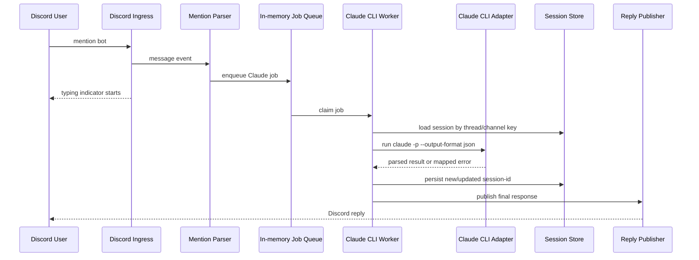

# Architecture

## Summary

v1 architecture는 Discord mention을 queue job으로 바꾸고, worker가 Claude Code CLI child process를 실행한 뒤 Discord reply를 publish하는 구조다.

핵심 decision:

- Bot App, not framework.
- Local Node Process, not Docker-first.
- Claude CLI Adapter, not Anthropic API Adapter.
- In-memory Queue, not Redis.
- JSON Session Store, not SQLite.

## Message Flow

## Module Map

```mermaid
flowchart TD
  Discord[Discord Gateway] --> Ingress[Discord Ingress Module]
  Ingress --> Parser[Mention Parser Module]
  Parser --> Queue[In-memory Job Queue Module]
  Queue --> Worker[Claude CLI Worker Module]
  Worker --> Adapter[Claude CLI Adapter]
  Worker --> Store[Session Store]
  Worker --> Logger[Structured Logger]
  Worker --> Publisher[Reply Publisher Module]
  Publisher --> DiscordAPI[Discord REST/Gateway]
  Store --> File[(.data/sessions.json)]
  Adapter --> CLI[claude CLI]
```

## Key Interfaces

`Mention Parser Interface`

- Input: Discord message event shape.
- Output: ignored result or normalized mention request.
- Invariants: bot authors ignored, mention required, prompt trimmed, max prompt size enforced later by config.

`Job Queue Interface`

- Input: normalized mention request.
- Output: accepted job with requestId.
- Invariants: event handler must not wait for Claude CLI completion.
- Error modes: queue full, invalid job, shutdown.

`Claude CLI Adapter Interface`

- Input: prompt, optional model, optional system prompt, optional session-id, timeout, no-tools policy.
- Output: normalized text result, metadata, session-id if available.
- Error modes: timeout, non-zero exit, invalid JSON, missing CLI, auth failure.
- Seam: future Adapter may use Anthropic API or another provider, but v1 keeps only CLI Adapter.

`Session Store Interface`

- Input: Discord scope key, session-id.
- Output: existing session-id or none.
- Invariants: key is thread ID when present, otherwise channel ID.
- Error modes: missing file, invalid JSON, write failure.
- Adapter: local JSON file.

`Reply Publisher Interface`

- Input: requestId, target message/channel, response text or failure.
- Output: Discord reply operations.
- Invariants: long response split respects Discord limit.
- Error modes: deleted message, permission failure, rate limit.

## Runtime Defaults

- queue concurrency: config-driven, conservative default `1`.
- Claude timeout: config-driven, conservative default `120s`.
- output format: `json`.
- tools: disabled by default.
- session persistence: `.data/sessions.json`.
- logging: structured console logs.

## Failure Handling

- Claude timeout: publish concise failure reply and log `timeout`.
- missing Claude CLI: fail fast at startup where possible; otherwise job failure includes setup guidance.
- auth failure: publish operator-facing failure reply without leaking secrets.
- invalid session mapping: remove broken mapping and retry only when implementation explicitly supports one safe retry.
- Discord reply failure: log with requestId and do not retry indefinitely.

## Extension TODO

- Redis Queue Adapter for multi-process workers.
- SQLite Session Store Adapter for stronger persistence.
- `stream-json` Adapter mode for streaming response.
- Slash command Ingress.
- DM Ingress.
- Provider Interface with OpenAI/Anthropic API Adapters.
- Docker deployment with explicit Claude CLI auth volume strategy.

